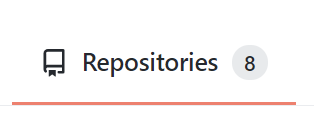
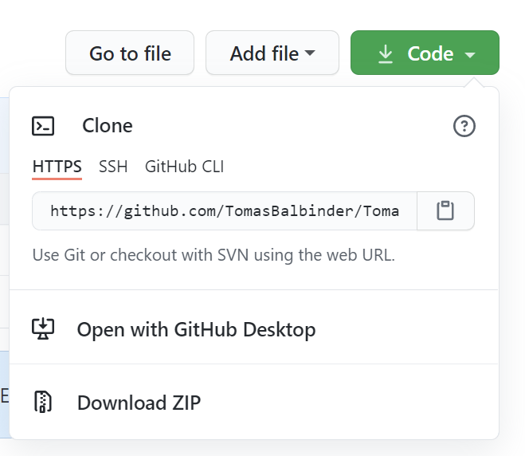

# <ins> Základy GITu_____________________</ins>
<p>&nbsp;</p>

### Co dělá Git:
___
* zaznamenává historii vývoje projektu
* dělá zálohy, kopie s metadaty
* ukláda zálohy na disk


### Co dělá Github:
___
* je místo kam můžeš nahrát svoji aplikaci, svůj kod.
* je veřejný server - cloud 
* funguje bez GITu a naopak
* je to jen jedna z možností
* ukláda zálohy na disk
* je úplně zadarmo


## Práce s Githubem
___
Jdi na stránku [GitHub](www.github.com) a zaregistruj se tam.\
Github má spoustu udělátek, ale ty teď řešit nebudem.

Důležité je najít `tohle`:



Poté najít ještě `tohle`:


Pak už jen jméno repozítáře(jmeno projektu)
Úplně dole zaškrnout `Add a README file` a taky `Choose a license`

a kliknout na `CREATE REPOSITORY` 

## Hotovo!
Vzdálený repozitář máme vytvořený.

## Jak propojit GitHub s Gitem?
---
**Jednoduše!**
## Tenhle příkaz je číslo jedna! 
Vytvoří repozítář ve vašem uložišti a můžete rovnou přeskočit na bod `2`. \
`0`
``` 
git clone adresa
```


## Práce s gitem:
___ 
### **A jak vlastně zjitím jestli mám už git nainstalovaný?**
Tenhle postup je pouze pro operační systém Windows.


Zmáčkněte klavesovou zkratku `win + Q` , poté napište **cmd** a zmáčkěte `enter` \
pak už piště do konzole:
```
git --version - Zjistí verzy gitu, pokud nic nevypíše, nemáš ho 
a je třeba ho instalovat [https://git-scm.com/](https://git-scm.com/)
```
Při prvním spuštění je potřeba vytvořit **jmeno** a **email**
pro pozdější synchronizaci s **Githubem**.

```
git config --global user.name “jméno”
git config --global user.email “e-mail”
```
**Při vytoření každného nového projektu je potřeba inizializovat složkuze které bude git nahlížet na soubory.**
```
git init - inicializuje adesář 
```
Poté, pokud již máte vytvořené nějaké soubory (*myšleno u vás na disku - nějaký skrypt, nebo program co jste vytvořili*)  

přichází na řadu:

`1`
```
git status - ukáže jakém se soubory nachází stavu
```
**Soubor** je potřeba *označit*:\
Je mnoho zpusobu jak to udělat, pár si jich tu ukážeme.
* *(příponu lze bud úplně vymazat nebo samozřejmě napsat jakokoliv jinou)* 

`2`
```
git add .exe - označí všechny soubory v adresáří s příponou 

git add * - označí všechny soubory v adresáří 

git add soubor - označí vybraný soubor 
``` 
---
<p>&nbsp;</p>
* Každý commit uloží novou verzy projektu (na tvůj disk). \

* **Takhle se postupuje kdykoliv když budeš měnit jednu věc v tvém programu, souboru, prjektu.** \
* *Kombinace kde používáte dva příkazy v jednom
je užitečná při jakekoliv změně souboru.*\
**Nefunguje když chcete přidat soubor nový!**.

`3`
```
git commit -m “komentář” - potvrzení změny vybraného souboru

git commit -am "komentář" - spojení 'add' s 'commitem'
```
---
`4`
```
git push origin main - poslání souboru na internet
```
```
git log - zobrazí historii commitu
```
Pohyb v logu je pomocí šipek nahoru a dolů. Ven z logu se dostanem pomocí klavesy `Q`.


```
git diff - zobrazí změny v souborech podrobněji než log
```

```
git checkout -- 'jmeno souboru'  - vrátí soubor do poslední verze commitu.
```

## Vrácení se ke starým verzím projektu
---

přes `git log` si  najdi `commit`, `číslo` (hash) a zkopíruj ho,\
potom napiš do konzole `git checkout` a číslo které jsi si nechal v schránce vlož.

**Takhe nějak by to mělo vypadat:**

```
git log 
git checkout 894d12f8fccc6feaeb586ac6b3ce64ac3c35d332
```

## Co je to ta větev ang.(branch)
---
Vždycky když začínáš nový projekt a přes `git init` inicializuješ složku se vytvaří tzv. `branch`, zatím je jen jedna a to ta hlavní, jmenuje se `main`. Později můžeš mít větví daleko víc, záleží na rozsáhlosti projektu. Většinou má programátor dvě nebo tři větve s kterými pracuje. 
```
git branch - ukáže všechny větve(branch)

git branch jmeno - vytvoří novou větev

git checkout jmeno - změna větve

git branch -d jmeno -vymazání větve (lokálně)
```


### další příkazy
```
git pull origin master natahne zmeny z githubu
git merge

git remote update natahne info ze serveru
pote git status a info ze zobrazi
```


<p>
Some Markdown text with <span style="color:red">git update-git-for-windows** update gitu </span>.

</p>


