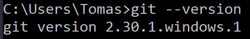

# <ins> Základy GITu_____________________</ins>
<p>&nbsp;</p>

### Co dělá Git:
___
* zaznamenává historii vývoje projektu
* dělá zálohy, kopie s metadaty
* ukláda zálohy na disk


### Co dělá Github:
___
* je místo kam můžeš nahrát svoji aplikaci, svůj kod.
* je veřejný server - cloud 
* funguje bez GITu a naopak
* je to jen jedna z možností
* ukláda zálohy na disk
* je úplně zadarmo

## Práce s gitem:
___ 
### **A jak vlastně zjitím jestli mám už git nainstalovaný?**
Tenhle postup je pouze pro operační systém Windows.



Zmáčkněte klavesovou zkratku `win + Q` , poté napište **cmd** a zmáčkěte `enter` \
pak už piště do konzole:
```
git --version - Zjistí verzy gitu, pokud nic nevypíše, nemáš ho 
a je třeba ho instalovat [https://git-scm.com/](https://git-scm.com/)
```
Při prvním spuštění je potřeba vytvořit **jmeno** a **email**
pro pozdější synchronizaci s **Githubem**.

```
git config --global user.name “jméno”
git config --global user.email “e-mail”
```
**Při vytoření každného nového projektu je potřeba inizializovat složkuze které bude git nahlížet na soubory.**
```
git init - inicializuje adesář 
```
Poté, pokud již máte vytvořené nějaké soubory (*myšleno u vás na disku - nějaký skrypt, nebo program co jste vytvořili*)  

přichází na řadu:
```
1. git status - ukáže jakém se soubory nachází stavu
```
**Soubor** je potřeba *označit*:\
Je mnoho zpusobu jak to udělat, pár si jich tu ukážeme.
* *(příponu lze bud úplně vymazat nebo samozřejmě napsat jakokoliv jinou)*
```
2. git add .exe - označí všechny soubory v adresáří s příponou 
```

```
2. git add * - označí všechny soubory v adresáří 
```
```
2. git add soubor - označí vybraný soubor
``` 

```
3. git commit -m “komentář” - potvrzení změny vybraného souboru,
každý commit uloží novou verzy projektu (na tvůj disk)
takhle se postupuje kdykoliv kdyz menim jednu vec v souboru ne vice veci najednou
```

**Kombinace kde používate dva příkazy v jednom** Užitečné při updatech souboru.
 **Nefunguje když chcete přidat soubor nový!!**.
```
git **commit** -am "komentář" 
```

**git log** historie commitu
sipkama nahoru a dolu pohyb a ven z logu klavesou Q

**git restore --staged jmenosouboru** pokud nechces
commit. nechces pridat zmenu do nove verze

**git restore --staged .** všechno v adresari

přeskočeni git add
**git commit -am ‘komentar’** pro nové soubory
**git commit -a** pro jiz commitle soubory


**git diff** zobrazi zmeny v souborech


**git checkout -- jmeno souboru** 
vrati do posledni commitle verze

vracenï se ke starym verzim

přes git log najdi si commit a číslo
potom napiš git checkout a cislo

zpět se dostaneš přes git checkout master


master je hlavni vetev kodu


**git clone a http adresa**, nakopiruje vše z githubu

**git pull origin master** natahne zmeny z githubu
**git merge** 

**git push origin master** dáváme soubory na internet - github
**git remote update** natahne info ze serveru
pote git status a info ze zobrazi

**git branch** nazev vytovreni nove vetve

**git checkout** nazev zmena vetve 


**git update-git-for-windows** update gitu 


git remote add origin pridani na github


